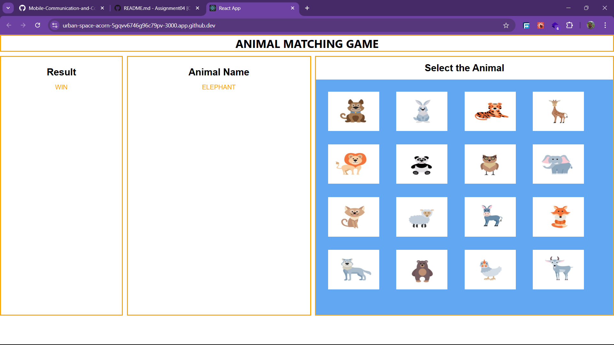

# Assignment04 - ANIMAL MATCHING GAME
---

A simple React-based game for children designed to improve object recognition and language skills. The player is tasked with identifying a randomly selected animal name by clicking on the correct animal image.

---

## Features
- Displays a randomly selected animal name.
- Grid of 16 clickable animal images.
- Displays a "Win" or "Again!" message based on the player's choice.

---
## Screenshots
- Win

- Lose

